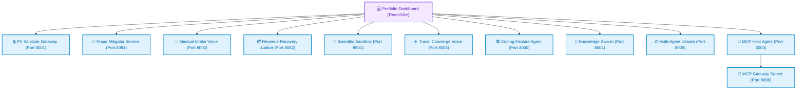

# 🚀 Agentic AI Applications Portfolio

<p align="center">
  
  
  
  
  
  
</p>

Welcome to the **Agentic AI Applications Portfolio**—a state-of-the-art collection of **18 specialized AI agent microservices** demonstrating advanced orchestrations, Retrieval-Augmented Generation (RAG), voice automation, serverless computation, event-driven streaming pipelines, and production-grade software engineering.

This monorepo consolidates multiple specialized AI services under a single React/Vite dashboard, allowing you to run, trigger, and inspect the outputs of parallel agents simultaneously.

---

## 🎨 System Architecture & Port Mapping

The portfolio consists of a unified React/Vite frontend that communicates with a fleet of specialized agent backends running in Hono (Node.js), FastAPI (Python), Go (Gin/Kafka), and NestJS.


```mermaid
graph TD
    classDef ui fill:#f3e8ff,stroke:#7c3aed,stroke-width:2px,color:#5b21b6;
    classDef port fill:#e0f2fe,stroke:#0284c7,stroke-width:2px,color:#0369a1;
    classDef agent fill:#fff7ed,stroke:#ea580c,stroke-width:2px,color:#9a3412;

    UI["💻 Portfolio Dashboard (React/Vite)"] --> P8001["🔒 PII Sanitizer Gateway (Port 8001)"]
    UI --> P8081["💸 Fraud Mitigator Service (Port 8081)"]
    UI --> P8002["🏥 Medical Intake Voice (Port 8002)"]
    UI --> P8082["💳 Revenue Recovery Auditor (Port 8082)"]
    UI --> P8501["🧪 Scientific Sandbox (Port 8501)"]
    UI --> P8003["✈️ Travel Concierge Voice (Port 8003)"]
    UI --> P3000["🛠️ Coding Feature Agent (Port 3000)"]
    UI --> P8004["🧠 Knowledge Swarm (Port 8004)"]
    UI --> P8005["⚖️ Multi-Agent Debate (Port 8005)"]
    UI --> P3003["🔌 MCP Host Agent (Port 3003)"]
    P3003 --> P8006["🧩 MCP Gateway Server (Port 8006)"]

    class UI ui;
    class P8001,P8081,P8002,P8082,P8501,P8003,P3000,P8004,P8005,P3003,P8006 port;
```

---

## 🛠️ Core Technology Stack

*   **Languages**: TypeScript (Strict), Python 3.12, Go 1.22, Rust
*   **Agent Orchestration**: Vercel AI SDK, LangGraph (JS/Python), CrewAI, PydanticAI, LiteLLM
*   **Databases & Vector Search**: Supabase (PostgreSQL), pgvector, Turso (SQLite), Milvus, Qdrant, Redis Stack
*   **Async Processing & Events**: Temporal.io (durable workflows), BullMQ, Apache Kafka, NATS
*   **observability & Evals**: Giskard, DeepEval, Ragas, LangSmith, Microsoft Presidio

---

## 🗂️ Registry of Agentic Applications

Here is the complete registry of all applications, tools, and frontends in this portfolio:

### 🌐 User Interface & Portfolio Hub
| Directory | Tech Stack | Role & Purpose |
| :--- | :--- | :--- |
| **[agentic-portfolio-ui](./agentic-portfolio-ui)** | React, TypeScript, Vite, TailwindCSS | The interactive dashboard that connects to, controls, and visualizes the outputs of all background agents in real-time. |

### 🤖 Standalone Agent Applications
| # | App Name & Folder | Primary Frameworks | Focus Area & Description |
| :---: | :--- | :--- | :--- |
| **1** | **[Feature Shippable Agent](./feature-shippable-agent)** | LangGraph.js, E2B Sandboxing | **Autonomous Coding Agent:** Analyzes requirements, searches codebase, writes/edits code inside an isolated E2B sandbox, runs tests, self-corrects on failures, and submits PRs. |
| **2** | **[Revenue Recovery Auditor](./revenue-recovery-auditor)** | Go, Temporal.io, Stripe API | **Fintech Automation:** Monitors Stripe events, queries customer value against PostgreSQL, and runs Temporal durable retention campaigns. |
| **3** | **[Scientific Research Sandbox](./scientific-research-sandbox)** | PydanticAI, Streamlit, Modal | **Serverless Data Science:** Writes and executes scientific Python code in a serverless Modal sandbox using IBM Docling for PDF ingestion. |
| **4** | **[Cloud Security Sentinel](./cloud-security-sentinel)** | Rust, Python, AWS SDK | **Cloud Security Ops:** Monitors config changes, runs automated responses for exposed access keys, and updates security groups. |
| **5** | **[Agentic Customer Support](./agentic-customer-support)** | Vercel AI SDK, Hono, Zod | **High-Reliability Tool-Use:** Handles order verification, shipment status, and refunds using strict schema constraints. |
| **6** | **[Autonomous DevRel Agent](./autonomous-devrel-agent)** | Haystack, Milvus Vector DB | **Community RAG:** Scrapes Discord and GitHub discussions, creating vector embeddings inside Milvus to handle complex product Q&A. |
| **7** | **[Medical Intake Nurse](./medical-intake-nurse)** | Vapi, Deepgram, FastAPI | **Healthcare Voice Agent:** Synthesizes realistic intake voice calls, transcribes responses, and compiles formatted clinical SOAP notes. |
| **8** | **[Real Estate Coordinator](./real-estate-coordinator)** | Vapi, Twilio, Node.js | **Sales Voice Agent:** Automatically answers real estate lead calls, filters client budgets/criteria, and logs bookings directly to Google Calendar. |
| **9** | **[Fintech Fraud Mitigator](./fintech-fraud-mitigator)** | Go, Apache Kafka, pgvector | **Event-Driven AI:** Streams transaction events, executes low-latency vector similarity matching inside PostgreSQL, and flags fraud anomalies. |
| **10** | **[Service Dispatch Coordinator](./service-dispatch-coordinator)** | CrewAI, BullMQ, NestJS | **Logistics & Negotiation:** Coordinates technician assignments, schedules job times, and negotiates vendor prices using nested CrewAI agent swarms. |
| **11** | **[Travel Concierge Agent](./travel-concierge-agent)** | Vapi, FastAPI, Python | **Voice Assistant:** Real-time conversational agent capable of coordinating trip bookings, hotel searches, and itinerary planning via voice commands. |
| **12** | **[Agentic Red-Teamer](./agentic-red-teamer)** | Giskard, DeepEval, Ragas | **Evaluation & Security:** Synthesizes adversarial inputs (injection, leaks, boundary cases) and runs automatic quality tests against other agents. |
| **13** | **[Model Router & Budget Sentinel](./model-router-sentinel)** | LiteLLM, Redis Stack, Bun | **Cost & Latency Gateway:** Routes queries to the cheapest model capable of solving them (Llama 3, GPT-4, Gemini) and utilizes Redis caching. |
| **14** | **[Autonomous Multi-modal QA](./multimodal-qa-agent)** | Playwright, GPT-4o Vision | **Visual Testing Robot:** Crawls web interfaces, captures screenshots, evaluates accessibility (contrast, buttons), and records verification videos. |
| **15** | **[Compliance & PII Sanitizer](./compliance-pii-sanitizer)** | Microsoft Presidio, Ollama, Phi-3 | **Privacy Gateway:** Intercepts outgoing LLM calls, masks or swaps PII (emails, names), and validates safety scores using a local Ollama instance. |
| **16** | **[Enterprise Knowledge Swarm](./enterprise-knowledge-swarm)** | FastAPI, Asyncio, RAG | **Hierarchical Swarm:** Uses a manager agent to split research queries and coordinate multiple parallel subagents to synthesize RAG reports. |
| **17** | **[Multi-Agent Debate](./multi-agent-debate)** | FastAPI, LLM-Debate | **Consensus Resolution:** Simulates a structured debate between a proponent agent and opponent agent on a given topic, moderated by a third agent. |
| **18** | **[MCP Tool Gateway](./mcp-tool-gateway)** | MCP SDK, TypeScript, Hono | **Protocol Interop:** An MCP server (stdio + Streamable HTTP on 8006) exposing tools, resources, and prompts, plus a host agent (3003) that discovers tools at runtime from the gateway *and* a third-party MCP server, then routes each call to its owner. |

---

## ⚡ Quick Start & Run Instructions

To spin up the entire suite of agent backends, you can use the unified PowerShell script:

### Prerequisites
1. Ensure you have the required runtimes installed: **Node.js (v18+)**, **Python (v3.10+)**, and **Go**.
2. Set up your environment variables by copying `.env.example` to `.env` in the respective application folders:
   ```bash
   cp .env.example .env
   ```

### Start Backends
Run the following script from the root directory:
```powershell
powershell -ExecutionPolicy Bypass -File .\start_all_backends.ps1
```

### Start Frontend UI
Navigate to the frontend folder and run the dev server:
```bash
cd agentic-portfolio-ui
npm install
npm run dev
```

---

## 📚 Portfolios & Guides

For deep dives into interviews, system architectures, and recruitment guides, check the `docs` directory:
*   **[Portfolio Questionnaire Mapping](./docs/portfolio_mapping.md):** Architectural patterns, RAG setups, and edge-case handling.
*   **[Detailed Professional Experience](./docs/professional_experience_detailed.md):** Long-term background in scaling production SaaS backends, database migrations, and CI/CD automation.

---

## 🏁 License & Contact

Distributed under the MIT License. See `LICENSE` for more information.

*Project Lead: Akmal Khan*  
*Email: akmal.shahbaz@iub.edu.pk*  
*Repository Link: [https://github.com/akmalkhaniub/agentic-apps-portfolio](https://github.com/akmalkhaniub/agentic-apps-portfolio)*
