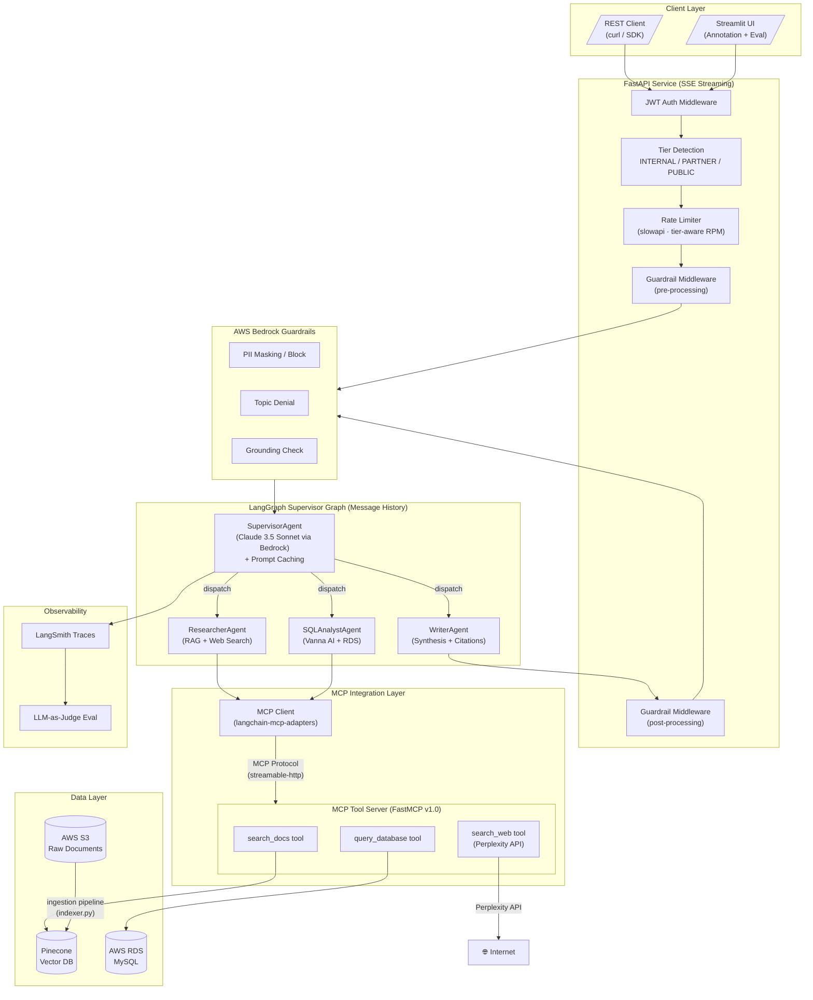
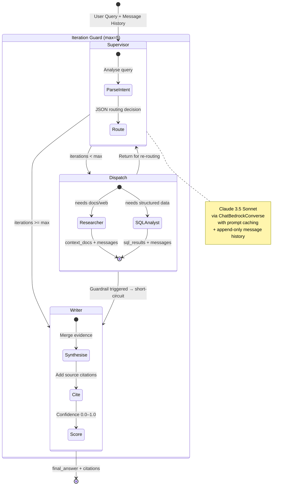
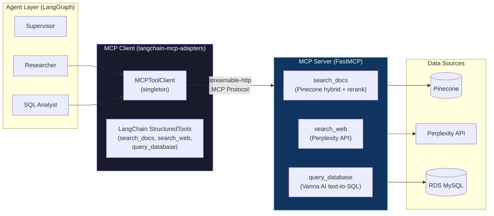
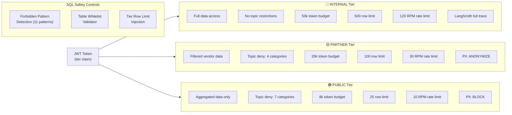
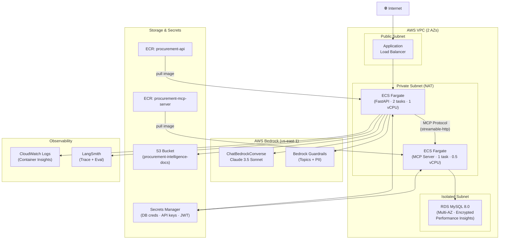
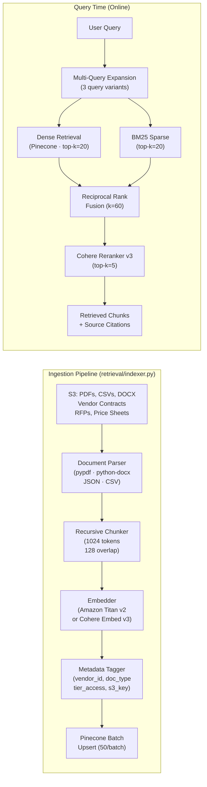
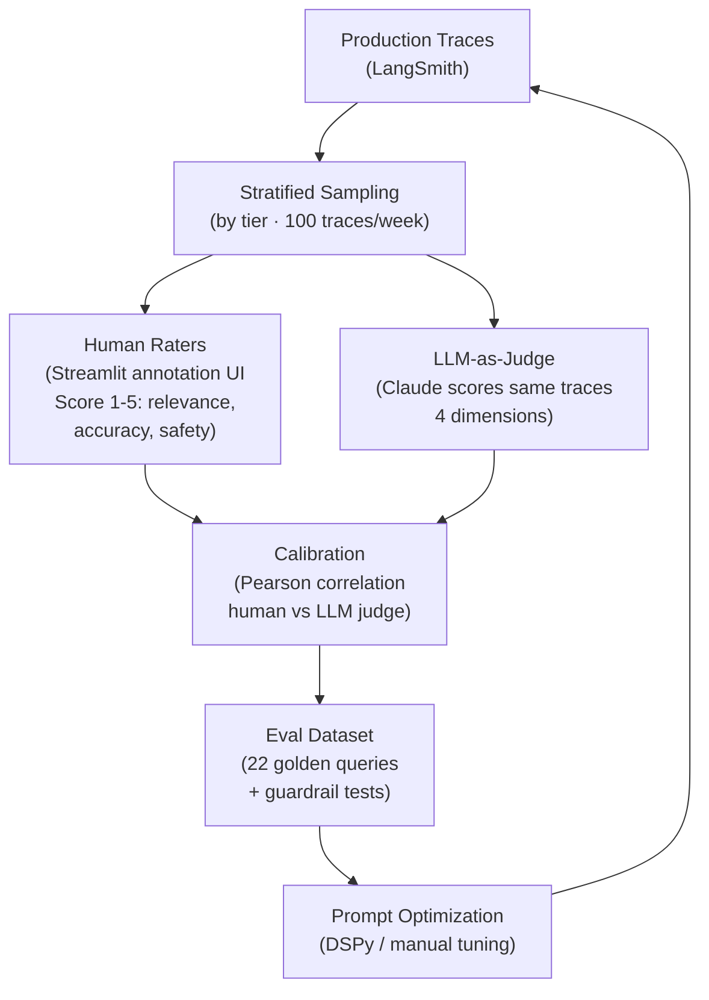

# 🏛️ Enterprise Procurement Intelligence Agent

A production-grade multi-agent system for autonomous procurement analysis, vendor intelligence, and spend optimization — built on the exact stack demanded by senior AI Engineer roles.

> **Stack:** LangGraph · MCP (Model Context Protocol) · Pinecone · Vanna AI · AWS Bedrock (Claude) · Bedrock Guardrails · LangSmith · FastAPI · Streamlit · AWS CDK

---

## 🗺️ System Architecture



---

## 🤖 Agent Topology (LangGraph StateGraph)



---

## 🔌 MCP Protocol Integration



---

## 🛡️ Guardrail & Safety Architecture



---

## ☁️ AWS Infrastructure (CDK)



---

## 📊 Retrieval & Ingestion Pipeline



---

## 🔄 LangSmith Eval Loop



---

## 🚀 Quick Start

```bash
# Install dependencies (using uv)
uv sync

# Copy and fill environment variables
cp .env.example .env

# Option A: Docker Compose (recommended for local dev)
docker compose up -d

# Option B: Run services individually
uv run python -m mcp_server.server --transport http --port 8080
uv run uvicorn api.main:app --reload --port 8000
uv run streamlit run ui/app.py

# Ingest documents from S3
uv run python -m ingestion.cli --bucket procurement-intelligence-docs --prefix contracts/ --tier internal --doc-type contract

# Run database migrations
uv run python -m migrations.schema upgrade

# Run tests
uv run pytest tests/ -v

# Run eval harness
uv run python -m eval.harness

# Deploy to AWS
cd infra && cdk deploy --all
```

---

## 📁 Project Structure

```
procurement-intelligence-agent/
├── agents/                   # LangGraph supervisor + sub-agents
│   ├── state.py              # Shared TypedDict state schema
│   ├── supervisor.py         # Supervisor routing agent (Claude)
│   ├── researcher.py         # RAG + web research agent
│   ├── sql_analyst.py        # Vanna AI SQL agent
│   ├── writer.py             # Synthesis + citation agent
│   ├── graph.py              # LangGraph StateGraph wiring (thread-safe)
│   ├── mcp_client.py         # MCP protocol client integration
│   └── json_utils.py         # Robust JSON extraction utility
├── mcp_server/               # FastMCP tool server (MCP protocol)
│   ├── server.py             # MCP server entrypoint (stdio + HTTP)
│   └── tools/                # Tool implementations
│       ├── search_docs.py    # Pinecone hybrid search tool
│       ├── search_web.py     # Perplexity API tool
│       └── query_database.py # Vanna AI SQL tool
├── retrieval/                # Pinecone retrieval pipeline
│   ├── embedder.py           # Titan/Cohere embedding (async)
│   ├── indexer.py            # S3 → parse → chunk → embed → upsert
│   └── retriever.py          # Hybrid search + RRF + Cohere rerank
├── ingestion/                # Document ingestion CLI
│   ├── __init__.py           # Re-exports indexer classes
│   └── cli.py                # CLI entrypoint (argparse)
├── migrations/               # Database schema management
│   └── schema.py             # SQLAlchemy schema + 13 indexes + upgrade/downgrade
├── sql_agent/                # Vanna AI text-to-SQL
│   ├── vanna_setup.py        # Schema training (4 DDLs, 5 golden pairs)
│   └── validator.py          # Query safety validation (22 patterns)
├── guardrails/               # Tier-based access control
│   ├── tiers.py              # 3-tier config with rate limits
│   ├── bedrock_guardrails.py # Bedrock ApplyGuardrail (async via to_thread)
│   └── middleware.py         # FastAPI pre/post guardrail middleware
├── api/                      # FastAPI service
│   ├── main.py               # App entrypoint + middleware stack
│   ├── auth.py               # JWT authentication
│   ├── rate_limiter.py       # Tier-aware rate limiting (slowapi)
│   ├── schemas.py            # Pydantic models (Citation, QueryResponse)
│   └── routes/
│       └── query.py          # SSE streaming endpoint (single invocation)
├── eval/                     # Evaluation + observability
│   ├── harness.py            # LangSmith trace extraction + metrics
│   ├── judge.py              # LLM-as-judge (async + sync)
│   └── datasets/
│       └── sample_queries.json  # 22-item eval dataset
├── infra/                    # AWS CDK stacks
│   ├── app.py                # CDK app entrypoint
│   └── stacks/
│       ├── database_stack.py # VPC + RDS MySQL (Multi-AZ, encrypted)
│       ├── bedrock_stack.py  # Bedrock Guardrail (topics + PII)
│       └── api_stack.py      # ECR + ECS Fargate (API + MCP services)
├── ui/                       # Streamlit annotation + eval dashboard
│   ├── app.py                # Main Streamlit app
│   └── pages/
│       ├── query_review.py   # Live query tester with SSE
│       └── eval_dashboard.py # Plotly eval metrics dashboard
├── tests/                    # pytest test suite (63+ tests)
│   ├── conftest.py           # Shared fixtures + mocked clients
│   ├── test_agents.py        # Routing, JSON extraction, state tests
│   ├── test_retrieval.py     # RRF, deduplication, chunker tests
│   ├── test_guardrails.py    # Tier config + SQL validator tests
│   └── test_api.py           # FastAPI integration tests
├── Dockerfile                # Multi-stage build (API)
├── Dockerfile.mcp            # MCP server build
├── docker-compose.yml        # Local dev: MySQL + API + MCP + Streamlit
├── pyproject.toml            # Dependencies (uv)
└── .env.example              # Environment template
```

---

## 🧪 Test Coverage

| Test File | Tests | Coverage Area |
|-----------|-------|---------------|
| `test_agents.py` | 20 | JSON extraction (7), routing logic (9), state factory (4) |
| `test_retrieval.py` | 10 | RRF fusion (5), deduplication (2), chunker (3) |
| `test_guardrails.py` | 21 | Tier config (10), SQL validator (10), tier parsing (1) |
| `test_api.py` | 12 | Health (2), auth (3), query (2), schemas (6) |
| **Total** | **63** | |

---

## 📈 Eval Metrics

| Metric | Target | Method |
|--------|--------|--------|
| Retrieval Precision@5 | > 0.80 | LLM-judge vs human |
| SQL Accuracy | > 0.90 | Execute + compare |
| Answer Faithfulness | > 0.85 | Groundedness check |
| Citation Quality | > 0.78 | Source verification |
| Latency P95 (INTERNAL) | < 8s | CloudWatch |
| Latency P95 (PUBLIC) | < 4s | CloudWatch |
| Guardrail False Positive Rate | < 2% | Human review |
| LLM-Judge ↔ Human Correlation | > 0.80 | Pearson r |
